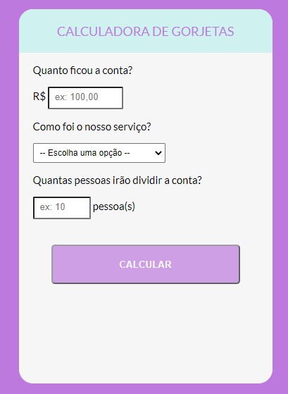

# Calculadora de Gorjetas

Projeto ministrado pela One Bit Code. 
A proposta é criar uma calculadora de gorjetas, onde o usuário entra com o valor total da conta, a porcentagem da gorjeta e quantas pessoas irão dividir o valor.

Foram inclusas algumas funcionalidades, como a obrigatoriedade do preenchimento de todos os campos, o efeito Hover no botão "Calcular" e as animações ao exibir o valor final para o usuário.

O deploy do projeto foi feito no site Netlify e o resultado final pode ser conferido [clicando aqui](https://calculadora-gorjeta-js-onebitcode.netlify.app/) ou clicando no GIF abaixo

# Technologies:
:small_orange_diamond: HTML5

:small_blue_diamond: CSS3

:star2: JavaScript

# Status: Done :heavy_check_mark:
